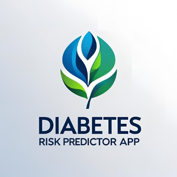

# 🩺 Diabetes Prediction App

**A simple e-health prediction tool built with MATLAB and WEKA**

---

## 📌 Overview

This project is a personal work as an **Electrical & Computer Engineering student**.  
It predicts the likelihood of diabetes based on patient health data using a **decision tree model (J48)** trained in **WEKA**, with a simple MATLAB GUI.

It’s an educational project demonstrating:
- 🧩 Data processing in MATLAB
- 🌳 Decision tree classification with WEKA
- 🖥️ A simple user-friendly standalone app

---

## 🗂️ What's in this repo

| File | Description |
|------|--------------|
| `diabetesPredictorApp.m` | Main MATLAB script for the app |
| `predictDiabetes.m` | MATLAB function with the decision tree logic |
| `PimaDiabetesJ48.model` | Trained WEKA model |
| `PimaIndiansDiabetes.csv` | Dataset used for training/testing |
| `UserGuide.pdf` | Step-by-step guide for running the app |
| `logo.png` | Project logo |

---

## ⚙️ How it works

- **Dataset:** Pima Indians Diabetes Dataset from adult women (CSV) link below
- [DATASET](https://www.kaggle.com/datasets/uciml/pima-indians-diabetes-database)
- **Algorithm:** J48 Decision Tree built in WEKA
- **Prediction:** Uses glucose, BMI, age, pregnancies, pedigree function, blood pressure
- **Output:** Predicts `Risk: Low` (No diabetes) or `Risk: High` (Diabetes)

---

## 🚀 How to run

### ▶️  Run from MATLAB
1. Clone this repo or download the ZIP.
2. Open `diabetesPredictorApp.m` in MATLAB.
3. Click **Run** — follow the prompts.
4. The decision tree logic is in `predictDiabetes.m`.

---

## 📸 Screenshots

---

## 📖 Documentation

Check `UserGuide.pdf` for full instructions:
- How the model works
- How to use the GUI

---

Connect with me:
- [LinkedIn](https://linkedin.com/in/georgios-kontotasios)
- [GitHub](https://github.com/GKodot)

---

## ⚠️ Disclaimer

This project is for **educational purposes only**.  
**Not for medical use** — always consult a healthcare professional for real diagnoses.

---

⭐ **If you like it, feel free to fork, star, or share!**

